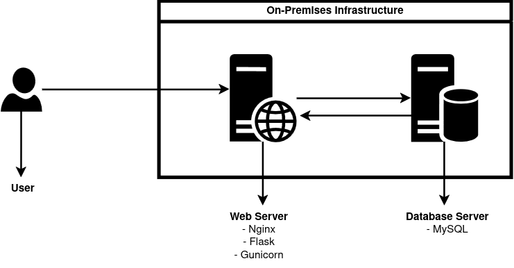
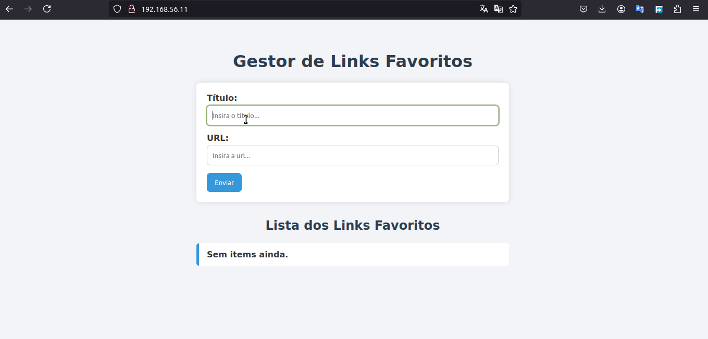

# Colocando em Produção

Esse estágio do projeto foca em colocar o software em produção, começarei por fazer o mais difícil, kkk. Colocar tudo a rodar e a funcionar. Colocarei o software a funcionar numa infraestrutura tradicional; configurações e instalações manuais, servidores e tais. As tecnologias base serão: Vagrant, servidor Ubuntu, o software, banco de dados...

## Diagrama da arquitectura

<div align="center">
    
</div>

## Requsitos

- Vagrant
- VirtualBox

## Como usar

1. Instalar o Vagrant

Para instalar o vagrant na sua máquina, você pode seguir o tutorial para instalação no seguinte link: Vagrant Install; é super rápido. E se quiseres ter uma noção rápida sobre o vagrant, visite: Vagrant Tutorial

E certifique-se de ter o VirtualBox instalado na tua máquina.

A seguir, você pode adicionar a box vagrant do Ubuntu/focal64 na sua máquina ou executar o Vagrantfile diretamente, porém, executar o Vagrantfile sem adicionar a box na sua máquina, fará com que o ficheiro faça download dessa box toda vez que quiseres rodar um ambiente; para rodar o ambiente, digite:

```bash
vagrant box add ubuntu/focal64
vagrant up
```

## Configurando e instalando do zero

### Configurando dependências do Servidor do Banco de Dados MySQL

Após rodar o `vagrant up` para provisionar duas máquinas para nossa infraestrutura com base no **Vagrantfile**, chegou a hora de instalar as dependências de cada servidor. Começarei pelo servidor de banco de dados MySQL, para acessá-lo use: `vagrant ssh db`.

Com acesso nele, execute os seguintes comandos:

1. Atualizar os repositórios:
```bash
sudo apt-get update
```

2. Instalar o servidor:
```bash
sudo apt-get install mysql-server
```

3. Configurar acesso de qualquer endereço:
```bash
sudo nano /etc/mysql/mysql.conf.d/mysqld.cnf
```

Insira esse informação: 
> [mysqld]
    bind-address = 0.0.0.0

4. Reiniciar o servidor:
```bash
sudo systemctl restart mysql.service
```

5. Alterar modo de autenticação do usuário root:
```bash
sudo mysql
ALTER USER 'root'@'localhost' IDENTIFIED WITH mysql_native_password BY 'senha123';
FLUSH PRIVILEGES;
EXIT;
```

6. Criando o banco de dados e eliminando o usuário anónimo padrão:
```bash
mysqladmin -u root -p create bookmark_schema
mysql -u root -p -e "SHOW DATABASES;"
mysql -u root -p -e "DELETE FROM mysql.user WHERE user=''; FLUSH PRIVILEGES;"
```

7. Melhorando a segurança criando o usuário "mateus" com privilégios total ao banco de dados
```bash
mysql -u root -p -e "CREATE USER 'mateus'@'%' IDENTIFIED BY 'bookmarksecret';"
mysql -u root -p -e "GRANT ALL PRIVILEGES ON bookmark_schema.* TO 'mateus'@'%';"
```

O banco de dados está vazio, mas vamos configurar rapidamente o servidor web.

### Configurando dependências do Servidor Web

Já configuramos as dependênciais do servidor MySQL, agora é o momento de passar para outra fase não menos importante, configurar o servidor web. Para acessar o servidor use: `vagrant ssh web`.

Com acesso nele, vamos fazer o seguinte:

1. Instalar o necessário
```bash
sudo apt-get update && sudo apt-get upgrade
sudo apt install python3 python3-pip python3-venv
sudo apt install mysql-client
sudo apt install nginx
```

2. Clonar repositório e instalar dependências da app
```bash
git clone --branch feature/putting-into-production --single-branch https://github.com/Mateus-Sebastiao/infra-bookmark-devops.git
cd infra-bookmark-devops/bookmark-app/
python3 -m venv venv
./venv/bin/pip install -r requirements.txt
sudo cp ../.env.example .env
```

3. Configurar o Nginx
```bash
sudo cp $HOME/infra-bookmark-devops/deploy/nginx.conf /etc/nginx/sites-available/bookmark
sudo ln -s /etc/nginx/sites-available/bookmark /etc/nginx/sites-enabled/
sudo rm /etc/nginx/sites-enabled/default
sudo nginx -t && sudo systemctl restart nginx
```

4. Configurar o Gunicorn como serviço
```bash
sudo cp $HOME/infra-bookmark-devops/deploy/gunicorn.service /etc/systemd/system/gunicorn.service
sudo systemctl daemon-reexec
sudo systemctl daemon-reload
sudo systemctl start gunicorn
sudo systemctl enable gunicorn
```

## App em funcionamento...

<div align="center">
    
</div>