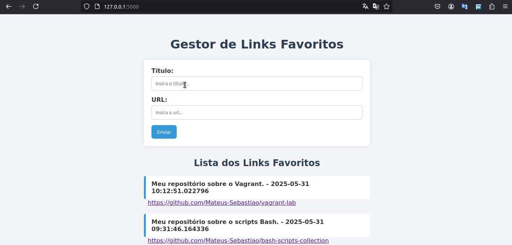

# Bookmark Manager

<div align="center">
    
</div>

Essa é uma aplicação web simples construída com **Flask**. Ela permite que você adicione, visualize e gerencie links favoritos (bookmarks). Desenvolvi para praticar os fundamentos de DevOps, os fundamentos de desenvolvimento web com Python e Flask, além de conceitos como banco de dados SQLite, templates Jinja, Vagrant e futuras práticas com Docker, Nginx e Ansible.

## Funcionalidades

- Adicionar links com título e URL.
- Visualizar todos os bookmarks em ordem de criação.
- Layout simples com HTML e CSS.
- Banco de dados local com SQLite.

## Tecnologias Utilizadas

- **Python3**
- **Flask**
- **SQLite** via SQLAlchemy
- **HTML5 + CSS3**
- **Jinja2**

## Como Executar

### 1. Clonar o Repositório

```bash
git clone https://github.com/Mateus-Sebastiao/infra-bookmark-devops.git
cd infra-bookmark-devops/bookmark-app/
```

### 2. Criar e ativar ambiente virtual
```bash
python3 -m venv venv
source venv/bin/activate
```

### 3. Instalar as dependências
```bash
pip install -r requirements.txt
```

### 4. Rodar a aplicação
```bash
flask run
```